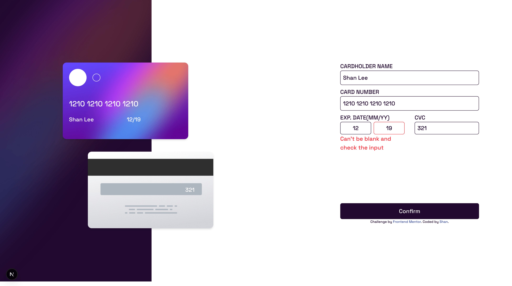
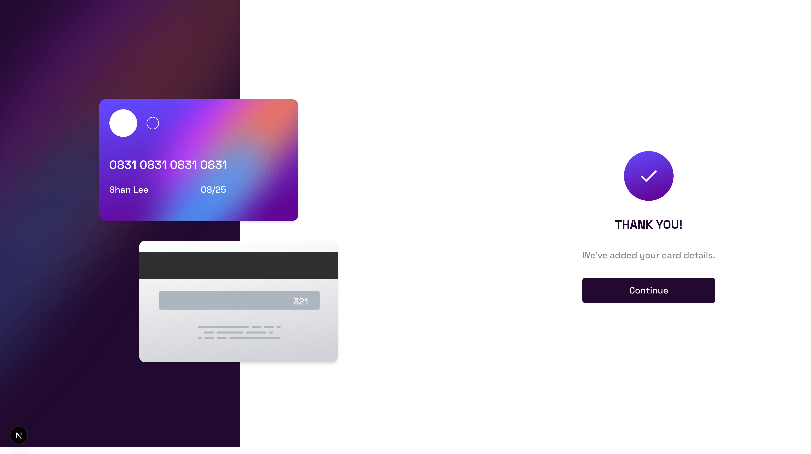
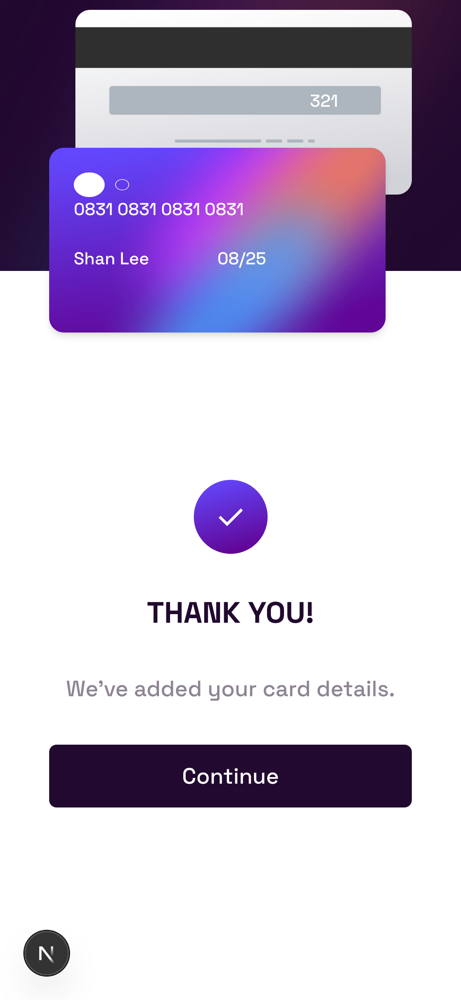

# 💳 Interactive Card Details Form

This is a frontend project challenge from [Frontend Mentor](https://www.frontendmentor.io/).  
The purpose of this project is to **improve my Tailwind CSS skills** and gain a **deeper understanding of responsive design**.

## 🛠 Tech Stack

- **Framework**: Next.js
- **Styling**: Tailwind CSS
- **Image Optimization**: Next/Image
- **Deployment**: (Optional – fill in if deployed)

## 🚀 What I Learned

- Building responsive UIs with Tailwind's utility classes
- Using custom breakpoints (`sm`, `md`, `lg`, etc.)
- Managing layouts using `grid` and `flex` systems
- Implementing conditional rendering based on screen size
- Structuring semantic HTML and accessible forms

## 📸 Screenshots


Desktop Display

Desktop Display (Success Message)
<figure>
  
  <figcaption style="text-align: center;">Mobile Display</figcaption>
</figure>
<figure>
  
  <figcaption style="text-align: center;">Mobile Display (Success Message) </figcaption>
</figure>

## 📁 Project Setup

1. Clone this repository
2. Install dependencies:
   ```bash
   npm install
3. Run this project
    ```bash
    npm run dev